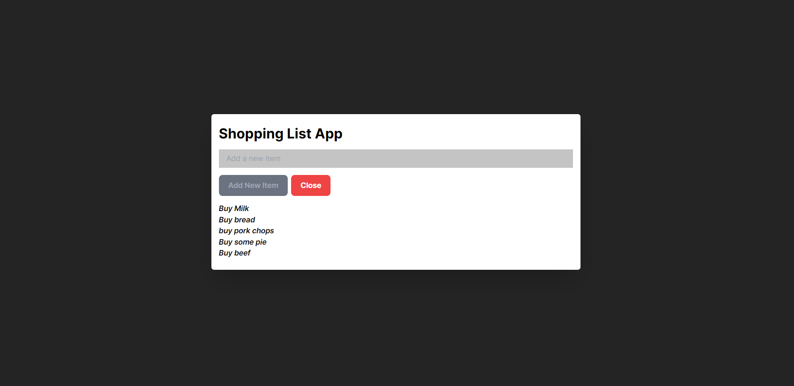

# Add logic to add new items to the shopping list and disable the add new item button when we hit our shopping list target

## Exercise 1  | 10min

- Download [project boilerplate](https://github.com/IanMcbull/vue-school-challenge/tree/master/composition-api)
- Open your terminal and run
- Run npm run dev to run the project
- Navigate into the src folder. The code you need to work on is in the App.vue file

## Instructions

### 1. Add logic to the *addNewItem* that adds a new item to the *shoppingList* array and updates the DOM

### 2. Implement logic for the *numberOfItems* computed property to keep track of the length of the *shoppingList* array.

### 3. Disable the "add new item button" when the list has more than 5 items by using a computed property that returns a boolean based on the length of the list. You can use the `ref` property to reference the list and check its length. Then, bind the `disabled` attribute of the button to the computed property.


1. Add logic to the ***addNewItem*** function

```jsx
// 💡 Add Logic here
const addNewitem = () => {
  
};

```

1. Add logic to the ***numberOfItems*** computed property

```jsx
// 💡 Add Logic here
const numberOfItems = computed(() => {
  
});
```

1. Bind the disabled attribute to our ***disable*** computed property.

```jsx
<button
      :class="disable ? 'bg-gray-500 text-gray-400':'bg-green-500 hover:bg-green-600'"
       class="text-white font-bold mt-4"
       type="submit"
        @click="showForm = true"
        // Add your code here        
/>
```

**Some helpful Vue docs:**

- [Computed properties](https://vuejs.org/guide/essentials/computed.html)
- [Vue directives](https://vuejs.org/guide/essentials/template-syntax.html#directives)

# Bonus

Disable the form input when we hit our shopping limit




# Solution

Please attempt the challenge before having a look at the solution. 💥

- [Project solution](https://github.com/IanMcbull/vue-school-challenge/tree/solution/composition-api)